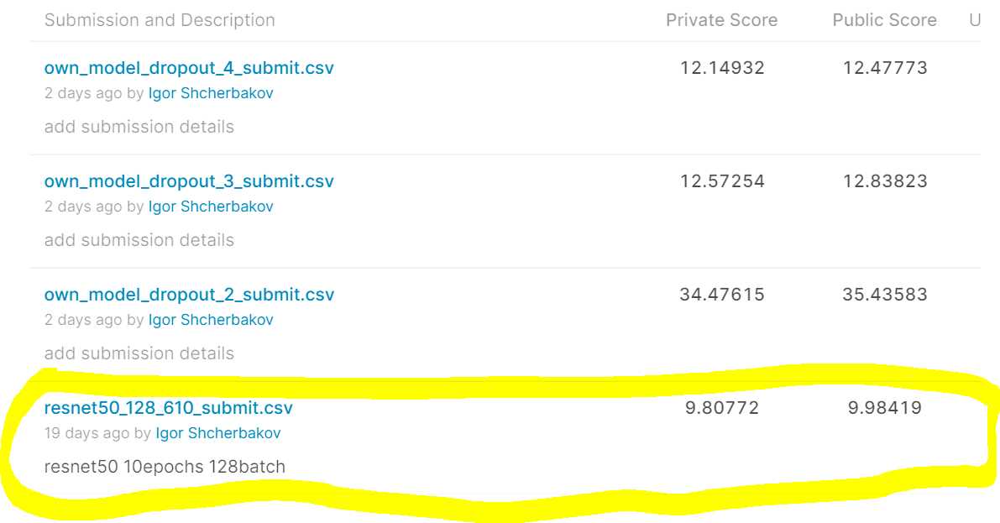

# Первое домашнее задание по CV MADE
Выполнил: Щербаков Игорь

## Описание решения
Решение выполнялось на AWS. 
Состоит из двух ноутбуков:
1. 0_load_data.ipynb - загрузка данных в AWS
2. 1_done.ipynb - обучние модели и формирование сабмита
И файлов скриптов из бейзлайна

Ход решения (файл 1_done.ipynb):
1. Подготавливается набор преобразователей данных
2. Читаются данные с применением трансформаций
3. Загрузка предобученной модели resnet50
4. Добавление собственной надстройки над предобученной моделью
5. Обучение и валидация модели
6. Формирование сабмита

Скриншот сабмитов:

